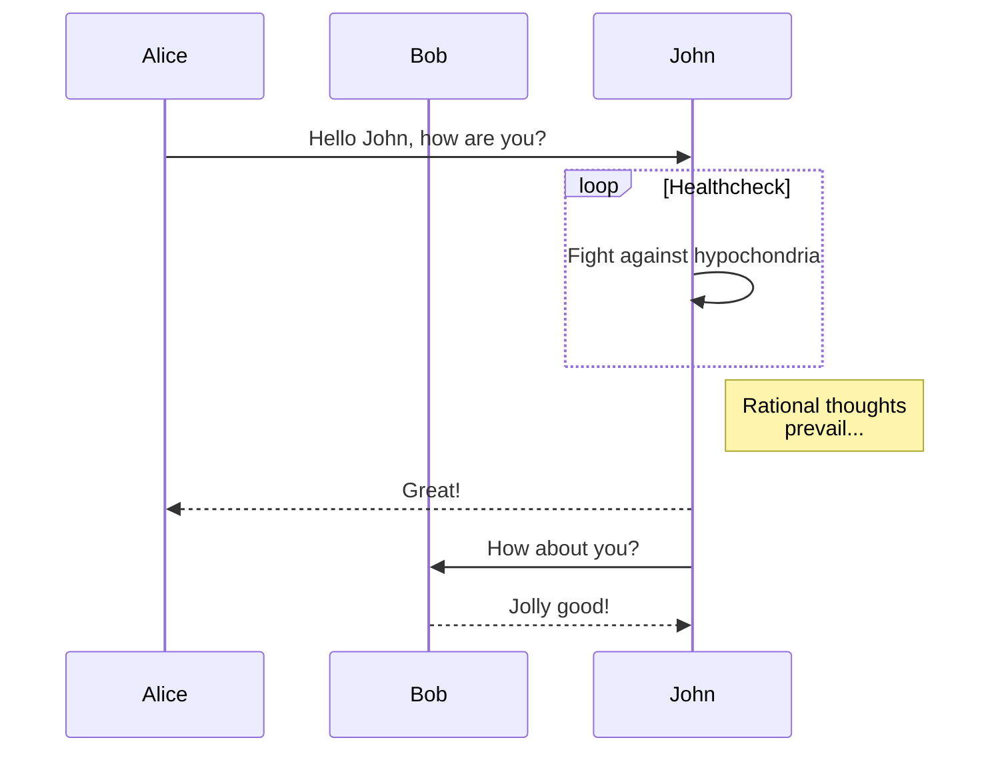
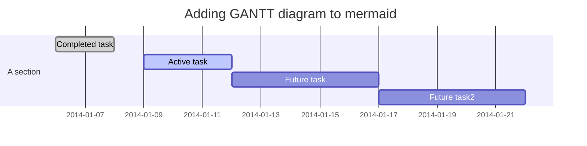

# 使用指南

版本: 1.0.0

日期: 2020-08-25 14:18:04


## Front-matter

```yaml
mathjax: true  #数学公式呈现支持
top: Num       #置顶
sticky: Num    #置顶
indexing: false  #不包含在搜索数据中               
sitemap: false   #不包含在站点地图中
description: XXX #自定义摘录内容
```

* `mathjax: true  #数学公式呈现支持` 
  * 依赖: Next主题内置的 `math.mathjax`和`math.katex`等配置及其脚本。
* `top: Num       #置顶`
  * 依赖: [hexo-generator-topindex](https://github.com/amlove2/hexo-generator-topindex)插件
  * 数字越大越置顶。
  * 配置项 `topindex_generator:`
* `sticky: Num    #置顶`
  * 依赖: [hexo-generator-index](https://github.com/hexojs/hexo-generator-index)插件，hexo官方出品。
  * 数字越大越置顶。
  * 配置项 `index_generator:`
* `indexing: false  #不包含在搜索数据中`
  * 依赖:  [hexo-generator-search](https://github.com/wzpan/hexo-generator-search) 插件
  * Next主题使用的是另一个插件 [hexo-generator-searchdb](https://github.com/theme-next/hexo-generator-searchdb)
  * 配置项  (站点) `search:` ，(主题) `local_search:`
* `sitemap: false   #不包含在站点地图中`
  * 依赖:  [hexo-generator-sitemap](https://github.com/hexojs/hexo-generator-sitemap) 插件，hexo官方出品。
* `description: XXX #自定义摘录内容`
  * 依赖: Next主题内置的 `excerpt_description`配置。
  * NexT提供了两种方法来控制文章序言文本: 
    * `<!-- more -->`在您的文章中使用,这是Hexo推荐的。
    * 读取Front-matter中的`description`属性值。优先级高
  * 另外可使用另一个摘录插件 [hexo-excerpt](https://github.com/chekun/hexo-excerpt)
    * 配置项  (站点) `excerpt:` 


## Markdown语法

当然，你可以在 Markdown 中使用所有 Markdown 的原生语法， 除此之外，有如下插件等提供的语法。


### 文章摘录

Plugin: https://github.com/chekun/hexo-excerpt   和  Next主题

```
NexT提供了两种方法来控制文章序言文本
    1. <!-- more -->在您的文章中使用,这是Hexo推荐的。
    2. 读取Front-matter中的description属性值。
```

推荐使用`description`，可自定义摘录内容。


### 视频

Plugin: https://github.com/m80126colin/hexo-tag-owl

嵌入各种视频和图像源到文章中。

```











```

* **youtube_id** - YouTube上的视频ID 
* **vimeo_id** - Vimeo中的视频ID
* [Niconico](http://www.nicovideo.jp/) 
  * **niconico_id** - Niconico中的视频ID
  * **type** - 内嵌式。只有`thumb`和`watch`两个选项。默认设置为`thumb`。 
    * `thumb`: 用额外的类`.niconico-thumb`将nico设置为thumb模式
    * `watch`: 用额外的类`.niconico-watch`将nico设置为watch模式
* [Bilibili](http://www.bilibili.com/)
  * **bilibili_id** - Bilibili的视频ID。您可以使用`av247371`或`247371` 或 `BV14b41177YA`  或 `14b41177YA`。 
  * **page** - 如果视频有多个剪辑，则可以添加一个表示视频的数字。 
  * **Width** - 视频宽。如 `544`
  * **height** - 视频高。如 `452`
* **tudou_id** - 土豆中的视频ID 
* **youku_id** - 优酷中的视频ID。您可以使用 `id_XMTc3MzcxMjQw` 或 `XMTc3MzcxMjQw`
  * **Width** - 视频宽。如 `100%`
  * **height** - 视频高。如 `452px`
* **tencent_id** - 腾讯视频中的视频ID 
  * **Width** - 视频宽。如 `100%`
  * **height** - 视频高。如 `452`
* [TED](http://www.ted.com/)
  * **ted_id** - TED中的视频ID 
  * **lang** - TED视频的字幕语言 


从博客的路径插入图像 

* **image_path**  - 您博客的相对路径。

从Giphy插入您的gif 

* **giphy_id**  - giphy ID


### 音频

Plugin: https://github.com/MoePlayer/hexo-tag-aplayer

在Hexo帖子/页面中嵌入aplayer。 [aplayer](https://github.com/MoePlayer/APlayer)： 漂亮的HTML5**音乐播放器** 

> 注意：
>
>  本地预览时，需要使用`hexo server -s ` 才能正确运行。
>
> 如下，meting和aplayer无法同时使用。

```

```

**标签参数**

* `title` : 曲目标题
* `author`: 曲目作者
* `url`: 音乐文件 URL 地址
* `picture_url`: (可选) 音乐对应的图片地址
* `narrow`: （可选）播放器袖珍风格
* `autoplay`: (可选) 自动播放，移动端浏览器暂时不支持此功能
* `width:xxx`: (可选) 播放器宽度 (默认: 100%)
* `lrc:xxx`: （可选）歌词文件 URL 地址

当开启 Hexo 的 [文章资源文件夹](https://hexo.io/zh-cn/docs/asset-folders.html#%E6%96%87%E7%AB%A0%E8%B5%84%E6%BA%90%E6%96%87%E4%BB%B6%E5%A4%B9) 功能时，可以将图片、音乐文件、歌词文件放入与文章对应的资源文件夹中，然后直接引用：

```

```

**歌词标签**

除了使用标签 `lrc` 选项来设定歌词，你也可以直接使用 `aplayerlrc` 标签来直接插入歌词文本在博客中：

```

[00:00.00]lrc here

```

**播放列表**

```

{
    "narrow": false,                          // （可选）播放器袖珍风格
    "autoplay": true,                         // （可选) 自动播放，移动端浏览器暂时不支持此功能
    "mode": "random",                         // （可选）曲目循环类型，有 'random'（随机播放）, 'single' (单曲播放), 'circulation' (循环播放), 'order' (列表播放)， 默认：'circulation' 
    "showlrc": 3,                             // （可选）歌词显示配置项，可选项有：1,2,3
    "mutex": true,                            // （可选）该选项开启时，如果同页面有其他 aplayer 播放，该播放器会暂停
    "theme": "#e6d0b2",	                      // （可选）播放器风格色彩设置，默认：#b7daff
    "preload": "metadata",                    // （可选）音乐文件预载入模式，可选项： 'none' 'metadata' 'auto', 默认: 'auto'
    "listmaxheight": "513px",                 // (可选) 该播放列表的最大长度
    "music": [
        {
            "title": "CoCo",
            "author": "Jeff Williams",
            "url": "caffeine.mp3",
            "pic": "caffeine.jpeg",
            "lrc": "caffeine.txt"
        },
        {
            "title": "アイロニ"  ,
            "author": "鹿乃",
            "url": "irony.mp3",
            "pic": "irony.jpg"
        }
    ]
}

```

**MeingJS 支持 (3.0 新功能)**

引入 MetingJS 后，播放器将支持对于 QQ音乐、网易云音乐、虾米、酷狗、百度等平台的音乐播放。 

可以通过 `` 在文章中使用 MetingJS 播放器了： 

```
<!-- 简单示例 (id, server, type)  -->


<!-- 进阶示例 -->

```

有关 `` 的选项列表如下:

| 选项          | 默认值     | 描述                                                        |
| ------------- | ---------- | ----------------------------------------------------------- |
| id            | **必须值** | 歌曲 id / 播放列表 id / 相册 id / 搜索关键字                |
| server        | **必须值** | 音乐平台: `netease`, `tencent`, `kugou`, `xiami`, `baidu`   |
| type          | **必须值** | `song`, `playlist`, `album`, `search`, `artist`             |
| fixed         | `false`    | 开启固定模式                                                |
| mini          | `false`    | 开启迷你模式                                                |
| loop          | `all`      | 列表循环模式：`all`, `one`,`none`                           |
| order         | `list`     | 列表播放模式： `list`, `random`                             |
| volume        | 0.7        | 播放器音量                                                  |
| lrctype       | 0          | 歌词格式类型                                                |
| listfolded    | `false`    | 指定音乐播放列表是否折叠                                    |
| storagename   | `metingjs` | LocalStorage 中存储播放器设定的键名                         |
| autoplay      | `true`     | 自动播放，移动端浏览器暂时不支持此功能                      |
| mutex         | `true`     | 该选项开启时，如果同页面有其他 aplayer 播放，该播放器会暂停 |
| listmaxheight | `340px`    | 播放列表的最大长度                                          |
| preload       | `auto`     | 音乐文件预载入模式，可选项： `none`, `metadata`, `auto`     |
| theme         | `#ad7a86`  | 播放器风格色彩设置                                          |

关于如何设置自建的 Meting API 服务器地址，以及其他 MetingJS 配置，请参考章节[自定义配置](https://github.com/MoePlayer/hexo-tag-aplayer/blob/master/docs/README-zh_cn.md#%E8%87%AA%E5%AE%9A%E4%B9%89%E9%85%8D%E7%BD%AE30-%E6%96%B0%E5%8A%9F%E8%83%BD)


### 图像

Plugin: 


### 代码演示 

Plugin: https://github.com/laomao800/hexo-tag-demo

在帖子内容中创建一个演示区(html、css、javascript)。

```
 ... 
```


### 内容块 

Plugin: https://github.com/lxl80/hexo-admonition

向文档中添加如提示、警告、错误等块式内容。

> 需要手动加载CSS文件，如在next主题配置文件中
>
> ```
> custom_file_path:
>   style: source/css/hexo-admonition.css
> ```
>
> 类似的，Next主题中有[note](https://github.com/theme-next/theme-next.org/blob/source/source/docs/tag-plugins/note.md)标签

```
!!! <Type> [Title] 
     提示内容开头留4个空格，可以有多行，最后用空行结束此标记。

```

每个块都以 `!!!` 开头，然后是代表提示类型的关键字(Type)及标题(Title)。
如果不想显示标题，可以将 title 设置为 `""`
支持如下类型:

* note
* info, todo
* warning, attention, caution
* error, failure, missing, fail


### 嵌入PDF 

~~Plugin: https://github.com/superalsrk/hexo-pdf~~

> 注: Next主题内置了([标签设置](https://github.com/theme-next/theme-next.org/tree/source/source/docs/tag-plugins))，以主题中的设置为准。

**site配置** 

```
#嵌入PDF
## Plugin: https://github.com/superalsrk/hexo-pdf
## Markdown语法:
##    
##    
## 注: Next主题内置了(标签设置)
```

**示例**

```

#或

```

2个插件语法相同，但不能同时使用，主题中的同名函数会覆盖站点插件中的函数。


### 二维码生成

Plugin: https://github.com/jsweibo/hexo-tag-qrcode

```

```

示例

```

```


### 信息卡片

Plugin: https://github.com/toastsgithub/hexo-valkyr-url

```

```

支持的key

* avatar : 描述链接的图像(可选)
* title : 标题
* desc : 描述
* url : 目标链接

注, 包含`[]`
示例

```

```


### Github信息卡片

Plugin: https://github.com/Gisonrg/hexo-github-card

```

```

(可选)支持的key:

* repo : 用户的GitHub存储库名称。如果省略，则仅显示用户个人资料
* width : 宽(px)，默认400
* height : 高(px)，默认200
* theme : 主题(default | medium)
* align : 文本对齐方式(left|center|right)
* client_id : 你的GitHub应用程序 ID
* client_secret : 你的GitHub应用程序 密钥

示例

```


```


### 工具提示

#### 脚注提示

Plugin: https://github.com/kchen0x/hexo-reference

```
basic footnote[^1]
here is an inline footnote[^2](inline footnote)
and another one[^3]
and another one[^4]

[^1]: basic footnote content
[^3]: paragraph
footnote
content
[^4]: footnote content with some [markdown](https://en.wikipedia.org/wiki/Markdown)
```


### 图表

如下的图表语法，可直接在Markdown中呈现。


#### flowchart

Plugin: https://github.com/bubkoo/hexo-filter-flowchart

生成**流程图**。 

**示例**

```
​```flow
... ...
​```
```


#### sequence

Plugin: https://github.com/bubkoo/hexo-filter-sequence

生成**UML序列图**。 

```
​```sequence
... ...
​```
```


#### ~~mermaid~~

Plugin: https://github.com/webappdevelp/hexo-filter-mermaid-diagrams

> 注：此插件因需要修改主题模板，未安装和配置，如下语法并不一定适用。

生成各种图表

**site配置**

```
#流程图mermaid
## Plugin: https://github.com/webappdevelp/hexo-filter-mermaid-diagrams
## Markdown示例:
##   See: doc/Use.md
mermaid: 
  enable: false  
  version: "7.1.2" 
  options:  #更多选项在 https://github.com/knsv/mermaid/blob/master/src/mermaidAPI.js
    #startOnload: true  
    theme: null
```


**流程图**

```
\```mermaid
graph TD;
    ... ...
\```
```


**顺序图** 

```
\```mermaid
sequenceDiagram
    ... ...
\```
```

**甘特图**

```
\```mermaid
gantt
    ... ...
\```
```



### 主题标签

某些主题中，提供了内置的一些标签，可在 Markdown 中使用。但是这些标签在Markdown中并不一定能呈现。如Next主题的 [标签](https://github.com/theme-next/theme-next.org/tree/source/source/docs/tag-plugins)

#### Next> Mermaid

> [Next> Mermaid-doc](https://github.com/theme-next/theme-next.org/blob/source/source/docs/tag-plugins/mermaid.md)

从文本生成图表和流程图 

**语法**

```

... ...

```

`type` : mermaid 图表类型

> 更多信息参阅 [knsv/mermaid](https://github.com/knsv/mermaid) => [mermaid-js/mermaid](https://github.com/mermaid-js/mermaid)
>
> 有关更多信息和入门帮助，请查看我们的[文档](https://mermaid-js.github.io/mermaid/#/)，以及[文本语法](https://mermaid-js.github.io/mermaid/#/n00b-syntaxReference)。

* [流程图](https://mermaid-js.github.io/mermaid/#/flowchart)  

  ```
  graph <方向>
     ... ...
  ```

  可能的流程图方向为：

  * TB -从上到下
  * TD -自顶向下/从上至下相同
  * BT -从下到上
  * RL -从右到左
  * LR -从左到右

* [顺序图](https://mermaid-js.github.io/mermaid/#/sequenceDiagram)

  顺序图是一个交互图，显示了流程如何相互操作以及以什么顺序进行操作。 

  ```
  sequenceDiagram
      ... ...
  ```

* [类图](https://mermaid-js.github.io/mermaid/#/classDiagram)

  “在软件工程中，统一建模语言（UML）中的类图是一种静态结构图，它通过显示系统的类，其属性，操作（或方法）以及对象之间的关系来描述系统的结构。 ” 

  ```
   classDiagram
        ... ...
  ```

* [状态图](https://github.com/mermaid-js/mermaid/blob/develop/docs/stateDiagram.md)

  ```
  stateDiagram-v2
        ... ...
  ```

* [甘特图](https://mermaid-js.github.io/mermaid/#/gantt)

  甘特图是一种条形图，它说明了一个项目进度表以及完成任何一个项目所需的时间。  

  ```
  gantt
        ... ...
  ```

* [饼形图](https://mermaid-js.github.io/mermaid/#/pie)

  ```
  pie  [title] [titlevalue]
      "[datakey1]" : [dataValue1] 
        ... ...
  ```


#### Next> PDF

> Plugin: https://github.com/theme-next/theme-next-pdf
>
> Doc:  [pdf.md](https://github.com/theme-next/theme-next.org/blob/source/source/docs/tag-plugins/pdf.md) 

嵌入PDF

**语法**

```


[url]    : PDF文件的相对路径。
[height] : 可选。PDF显示元素的高度，例如 800px.
```

**示例**

```


```


#### Next> Note

> Doc:  [note.md](https://github.com/theme-next/theme-next.org/blob/source/source/docs/tag-plugins/note.md)

向文档中添加如提示、警告、错误等块式内容。

**语法**

```

任何内容（支持内联标记)

```

`[class]`   : default | primary | success | info | warning | danger
`[no-icon]` : 禁用便笺中的图标。

所有参数都是可选的。

**示例**

```

#### Header
(without define class style)



#### Default Header
Welcome to [Hexo!](https://hexo.io)



#### No icon note
Note **without** icon: `note info no-icon`

```


#### Next> Video 

> Doc:  [video.md](https://github.com/theme-next/theme-next.org/blob/source/source/docs/tag-plugins/video.md)

```

```

**示例**

```


```


#### Next> group-pictures

> Doc:  [group-pictures.md](https://github.com/theme-next/theme-next.org/blob/source/source/docs/tag-plugins/group-pictures.md)

非流式的一组图片。

```



[group]  : 要添加到组中的图片总数。
[layout] : 组中的默认图片用于显示的
```

 **示例**

```

  
  
  
  
  
  

```


#### Next> Tabs 

> Doc:  [tabs.md](https://github.com/theme-next/theme-next.org/blob/source/source/docs/tag-plugins/tabs.md)

```

<!-- tab [Tab caption] [@icon] -->
任何内容（也支持内联标记）。
<!-- endtab -->


Unique name   : 选项卡块标签的唯一名称，不带逗号。
                将在#id中用作每个选项卡的前缀及其索引号。
                如果名称中有空格，则对于生成的#id，所有空白都将替换为破折号。
                仅对当前的帖子/页面的url必须是唯一的！
[index]       : 活动选项卡的索引号。
                如果未指定，将选择第一个选项卡（1）。
                如果索引为-1，则不会选择任何选项卡。它会像扰流板一样。
                可选参数
[Tab caption] : 当前选项卡的标题。
                如果没有指定的标题，将使用选项卡索引后缀的唯一名称作为选项卡的标题。
                如果未指定标题，但指定了图标，则标题将为空。
                可选参数
[@icon]       : FontAwesome 图标名称(没有开始部分的 'fa-').
                可指定有空格或无空格； 如 'Tab caption @icon' 类似于 'Tab caption@icon'.
                可选参数
```

**示例** 

```

<!-- tab -->
**This is Tab 1.**
<!-- endtab -->

<!-- tab -->
**This is Tab 2.**
<!-- endtab -->

<!-- tab -->
**This is Tab 3.**
<!-- endtab -->

```


## 命令行

### 哔哩哔哩番剧页面

Plugin: https://github.com/HCLonely/hexo-bilibili-bangumi

如下命令在`hexo generate`或`hexo deploy`之前使用

```
更新数据: hexo bangumi -u
删除数据: hexo bangumi -d
```

注: 需要将追番列表设置为公开在 bilibili中。


## 模版修改

### ~~全局许可证~~

Plugin: https://github.com/sbanwart/hexo-global-license

将全局许可证助手添加到主题模板中: 

```
<%- globalLicense(config) %>
```

**site配置**

```
#全局许可证
## Plugin: https://github.com/sbanwart/hexo-global-license
## 将全局许可证助手添加到主题模板中: <%- globalLicense(config) %>
## 支持类型
##   by: 署名
##   by-nd: 署名-禁止衍生
##   by-sa: 署名-相同方式分享
##   by-nc: 署名-非商业性
##   by-nc-nd: 署名-非商业性-禁止衍生
##   by-nc-sa: 署名-非商业性-相同方式分享
##   custom: 指定您自己的自定义许可证HTML
#许可类型
licenseType: by-nc-sa
#图标大小(normal | small)
licenseIconSize: normal
#自定义许可证语句的标记和文本；仅当licenseType设置为custom时才需要
customLicense: <div>My custom license text.</div>
```


