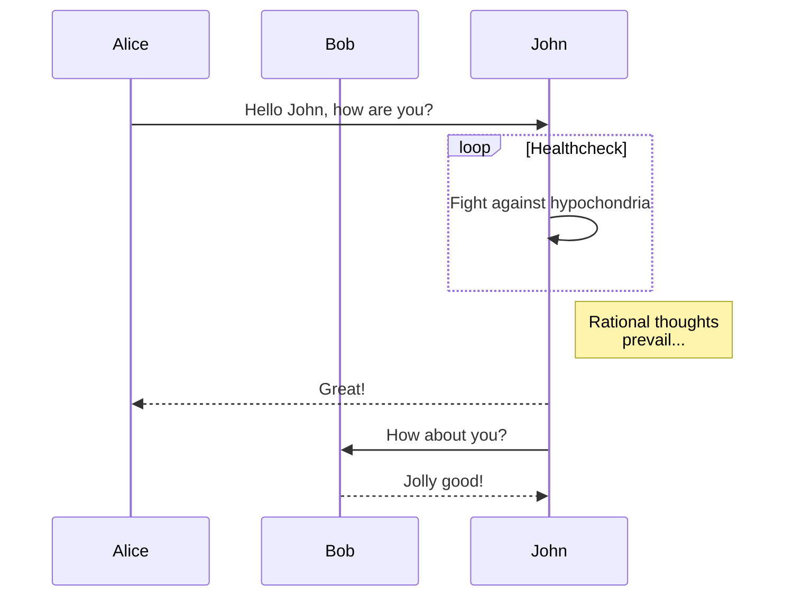
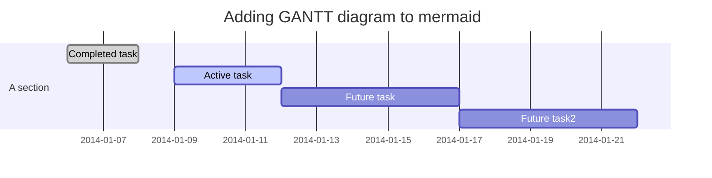

# User guide

Version: 1.0.0

Date: 2020-08-25 14:18:04


## Front-matter

```yaml
mathjax: true  #Support for mathematical formula
top: Num       #Topping
sticky: Num    #Topping
indexing: false  #Not included in search data               
sitemap: false   #Not included in site map
description: XXX #Custom extract content
```

* `mathjax: true  #Support for mathematical formula` 
  * Depend: Next theme built-in `math.mathjax` and `math.katex` And its script.
* `top: Num       #Topping`
  * Depend: [hexo-generator-topindex](https://github.com/amlove2/hexo-generator-topindex)
  * he bigger the number, the more the top.
  * Configuration item `topindex_generator:`
* `sticky: Num    #Topping`
  * Depend: [hexo-generator-index](https://github.com/hexojs/hexo-generator-index)，Official product of hexo.
  * he bigger the number, the more the top.
  * Configuration item `index_generator:`
* `indexing: false  #Not included in search data`
  * Depend:  [hexo-generator-search](https://github.com/wzpan/hexo-generator-search) 
  * The next theme uses another plug-in [hexo-generator-searchdb](https://github.com/theme-next/hexo-generator-searchdb)
  * Configuration item  (Site) `search:` ，(Theme) `local_search:`
* `sitemap: false   #Not included in site map`
  * Depend:  [hexo-generator-sitemap](https://github.com/hexojs/hexo-generator-sitemap) ，Official product of hexo.
* `description: XXX #Custom extract content`
  * Depend: Next theme built-in `excerpt_description` Configuration item.
  * Next provides two ways to control the text of the preface:
    * `<!-- more -->` is used in your article, which is recommended by hexo.
    * Read the `description` attribute value in Front-matter. High priority.
  * Another excerpt plug-in  [hexo-excerpt](https://github.com/chekun/hexo-excerpt) can be used
    * Configuration item  (Site) `excerpt:` 


## Markdown syntax

Of course, you can use all of markdown's native syntax. In addition, the following plug-ins provide syntax.


### Articles excerpts 

Plugin: https://github.com/chekun/hexo-excerpt   and Next theme

```
Next provides two ways to control the text of the preface
    1. <!-- more -->is used in your article, which is recommended by hexo.
    2. Read the description attribute value in Front-matter. 
```

`description` is recommended because it is customizable.


### Video

Plugin: https://github.com/m80126colin/hexo-tag-owl

Embed various video and image sources into the article.

```











```

* **youtube_id** - video id on Youtube
* **vimeo_id** - video id in Vimeo.
* [Niconico](http://www.nicovideo.jp/) 
  * **niconico_id** - video id in Niconico.
  * **type** - embeded type. There are only `thumb` and `watch` two options. Default is set as `thumb`.
    * `thumb`: set nico in thumb mode with extra class `.niconico-thumb`
    * `watch`: set nico in watch mode with extra class `.niconico-watch`
* [Bilibili](http://www.bilibili.com/)
  * **bilibili_id** - video id in Bilibili. You can use either `av247371` or `247371` or `BV14b41177YA`  or `14b41177YA`。 
  * **page** - if video have several clips, you can add a number indicated the video.
  * **Width** - Video width. eg  `544`
  * **height** - Video height. eg  `452`
* **tudou_id** - video id in Tudou.
* **youku_id** - video id in Youku. You can use either `id_XMTc3MzcxMjQw` or `XMTc3MzcxMjQw`. 
  * **Width** -Video width. eg  `100%`
  * **height** - Video height. eg  `452px` 
* **tencent_id** - video id in Tencent Video.
  * **Width** - Video width. eg  `100%`
  * **height** - Video height. eg  `452`
* [TED](http://www.ted.com/)
  * **ted_id** - video id in TED.
  * **lang** - subtitle language for TED videos.


Insert image from blog path

* **image_path**  - The relative path of your blog.

Insert your gif from Giphy. 

* **giphy_id**  - giphy ID


### Audio

Plugin: https://github.com/MoePlayer/hexo-tag-aplayer

Embed aplayer in hexo posts/pages.  [aplayer](https://github.com/MoePlayer/APlayer)： Beautiful HTML5 **music player**.

> Note:
>
> When previewing locally, you need to use `hexo server -s `  to run correctly.
>
> As follows, metering and aplayer cannot be used at the same time.

```

```

**标签参数**

* `title` : music title
* `author`: music author
* `url`: music file url
* `picture_url`: optional, music picture url
* `narrow`: optional, narrow style
* `autoplay`: optional, autoplay music, not supported by mobile browsers
* `width:xxx`: optional, prefix `width:`, player's width (default: 100%)
* `lrc:xxx`: optional, prefix `lrc:`, LRC file url

With [post asset folders](https://hexo.io/docs/asset-folders.html#Tag-Plugins-For-Relative-Path-Referencing) enabled, you can easily place your image, music and LRC file into asset folder, and reference them like: 

```

```

**Lyrics tag**

Besides `lrc`  option, you can use `aplayerlrc` which has end tag to show lyrics. 

```

[00:00.00]lrc here

```

**Playlist**

```

{
    "narrow": false,                          // Optional, narrow style
    "autoplay": true,                         // Optional, autoplay song(s), not supported by mobile browsers
    "mode": "random",                         // Optional, play mode, can be `random` `single` `circulation`(loop) `order`(no loop), default: `circulation`
    "showlrc": 3,                             // Optional, show lrc, can be 1, 2, 3
    "mutex": true,                            // Optional, pause other players when this player playing
    "theme": "#e6d0b2",	                      // Optional, theme color, default: #b7daff
    "preload": "metadata",                    // Optional, the way to load music, can be 'none' 'metadata' 'auto', default: 'auto'
    "listmaxheight": "513px",                 // Optional, max height of play list
    "music": [
        {
            "title": "CoCo",
            "author": "Jeff Williams",
            "url": "caffeine.mp3",
            "pic": "caffeine.jpeg",
            "lrc": "caffeine.txt"
        },
        {
            "title": "アイロニ",
            "author": "鹿乃",
            "url": "irony.mp3",
            "pic": "irony.jpg"
        }
    ]
}

```

**MeingJS support (new in 3.0)**

When you use MetingJS, your blog can play musics from Tencent, Netease, Xiami, Kugou, Baidu and more. 

Now you can use `` in your post: 

```
<!-- Simple example (id, server, type)  -->


<!-- Advanced example -->

```

The `` options are shown below:

| Option        | Default      | Description                                                  |
| ------------- | ------------ | ------------------------------------------------------------ |
| id            | **required** | song id / playlist id / album id / search keyword            |
| server        | **required** | Music platform: `netease`, `tencent`, `kugou`, `xiami`, `baidu` |
| type          | **required** | `song`, `playlist`, `album`, `search`, `artist`              |
| fixed         | `false`      | Enable fixed mode                                            |
| mini          | `false`      | Enable mini mode                                             |
| loop          | `all`        | Player loop play, values: 'all', 'one', 'none'               |
| order         | `list`       | Player play order, values: 'list', 'random'                  |
| volume        | 0.7          | Default volume, notice that player will remember user setting, default volume will not work after user set volume themselves |
| lrctype       | 0            | Lyric type                                                   |
| listfolded    | `false`      | Indicate whether list should folded at first                 |
| autoplay      | `false`      | Autoplay song(s), not supported by mobile browsers           |
| mutex         | `true`       | Pause other players when this player playing                 |
| listmaxheight | `340px`      | Max height of play list                                      |
| preload       | `auto`       | The way to load music, can be `none`, `metadata`, `auto`     |
| storagename   | `metingjs`   | LocalStorage key that store player setting                   |
| theme         | `#ad7a86`    | Theme color                                                  |

Read section [customization](https://github.com/MoePlayer/hexo-tag-aplayer#customization-new-in-30) to learn how to configure self-host meting api server in `hexo-tag-aplayer` and other configuration.


### Images

Plugin: 


### Code demo 

Plugin: https://github.com/laomao800/hexo-tag-demo

Create a demo area (html, css, javascript) in the post content. 

```
 ... 
```


### Content block 

Plugin: https://github.com/lxl80/hexo-admonition

Add block content such as prompts, warnings, errors, etc. to the post.

> CSS files need to be loaded manually, such as in the next theme configuration file
>
> ```
> custom_file_path:
>   style: source/css/hexo-admonition.css
> ```
>
> Similarly, the next theme has a [note](https://github.com/theme-next/theme-next.org/blob/source/source/docs/tag-plugins/note.md) tag

```
!!! <Type> [Title] 
     Leave four spaces at the beginning of the content, which can have multiple lines, and end the tag with a blank line.

```

Each block begins with a `!!!`, followed by the type and title.

If you don't want to display the title, you can set the title to  `""`.

The following types are supported:

* note
* info, todo
* warning, attention, caution
* error, failure, missing, fail


### Embed PDF 

~~Plugin: https://github.com/superalsrk/hexo-pdf~~

> Note: the Next theme is built in ([label settings](https://github.com/theme-next/theme-next.org/tree/source/source/docs/tag-plugins)), with the setting in the theme as the criterion.

**Site configuration** 

```
#Embed PDF
## Plugin: https://github.com/superalsrk/hexo-pdf
## Markdown syntax:
##    
##    
## Note: the Next theme is built in (label settings)
```

**Example**

```

#or

```

The syntax of the two plug-ins is the same, but they cannot be used at the same time. The function with the same name in the theme will override the function in the site plug-in.


### QR code generate

Plugin: https://github.com/jsweibo/hexo-tag-qrcode

```

```

Example

```

```


### Information card

Plugin: https://github.com/toastsgithub/hexo-valkyr-url

```

```

Supported key:

* `avatar` image that describe your link (optional)
* `title` title
* `desc` description
* `url` destination when you click image url or title

Note, including `[]`

Example

```

```


### Github information card

Plugin: https://github.com/Gisonrg/hexo-github-card

```

```

(Optional)Supported key:

* repo : (Optional) GitHub repository name of the user. If omit then display only the user profile .
* width : (Optional) Widget's width (in 'px'). Default is 400. 
* height : (Optional) Widget's height (in 'px'). Default is 200. 
* theme : GitHub card theme(default | medium).
* align : (Optional) What kind of text-align(left|center|right) is you want. Default is center.
* client_id : (Optional) Your GitHub app client_id .
* client_secret : (Optional) Your GitHub app client_secret .

Example

```


```


### Tooltip

#### Footnotes

Plugin: https://github.com/kchen0x/hexo-reference

```
basic footnote[^1]
here is an inline footnote[^2](inline footnote)
and another one[^3]
and another one[^4]

[^1]: basic footnote content
[^3]: paragraph
footnote
content
[^4]: footnote content with some [markdown](https://en.wikipedia.org/wiki/Markdown)
```


### Chart

The following diagram syntax can be presented directly in markdown.


#### flowchart

Plugin: https://github.com/bubkoo/hexo-filter-flowchart

Generate  **flowchart**.

**Example**

```
​```flow
... ...
​```
```


#### sequence

Plugin: https://github.com/bubkoo/hexo-filter-sequence

Generate  **UML sequence diagram**

```
​```sequence
... ...
​```
```


#### ~~mermaid~~

Plugin: https://github.com/webappdevelp/hexo-filter-mermaid-diagrams

> Note: this plug-in is not installed and configured because it needs to modify the theme template. The following syntax is not necessarily applicable.

Generate various charts

**Site configuration**

```
#mermaid chart
## Plugin: https://github.com/webappdevelp/hexo-filter-mermaid-diagrams
## Markdown Example:
##   See: doc/Use.md
mermaid: 
  enable: false  
  version: "7.1.2" 
  options:  #More options in https://github.com/knsv/mermaid/blob/master/src/mermaidAPI.js
    #startOnload: true  
    theme: null
```


**flow chart**

```
\```mermaid
graph TD;
    ... ...
\```
```


**Sequence diagram** 

```
\```mermaid
sequenceDiagram
    ... ...
\```
```

**Gantt**

```
\```mermaid
gantt
    ... ...
\```
```



### Theme Tags

Some of the theme provide some built-in tags that can be used in Markdown.

However, these tags do not necessarily render in markdown. For example, the [Tags](https://github.com/theme-next/theme-next.org/tree/source/source/docs/tag-plugins) for the next theme.

#### Next> Mermaid

> [Next> Mermaid-doc](https://github.com/theme-next/theme-next.org/blob/source/source/docs/tag-plugins/mermaid.md)

Generate diagrams and flowcharts from text

**Syntax**

```

... ...

```

`type` : mermaid chart type

> For more information, see [knsv/mermaid](https://github.com/knsv/mermaid) => [mermaid-js/mermaid](https://github.com/mermaid-js/mermaid)
>
> For more information and getting started, check out our [documentation](https://mermaid-js.github.io/mermaid/#/), as well as [text syntax](https://mermaid-js.github.io/mermaid/#/n00b-syntaxReference).

* [flowchart](https://mermaid-js.github.io/mermaid/#/flowchart)  

  ```
  graph <directions>
     ... ...
  ```

  Possible flow chart directions are:

  * TB - top to bottom
  * TD - top down/top to bottom
  * BT - bottom to top
  * RL - right to left
  * LR - left to right

* [Sequence Diagram](https://mermaid-js.github.io/mermaid/#/sequenceDiagram)

  A sequence diagram is an interaction diagram that shows how processes interact with each other and in what order.

  ```
  sequenceDiagram
      ... ...
  ```

* [Class Diagram](https://mermaid-js.github.io/mermaid/#/classDiagram)

  “In software engineering, the class diagram in Unified Modeling Language (UML) is a static structural graph that describes the structure of the system by displaying the attributes, operations (or methods) and relationships between the objects of the system.”

  ```
   classDiagram
        ... ...
  ```

* [State Diagram](https://github.com/mermaid-js/mermaid/blob/develop/docs/stateDiagram.md)

  ```
  stateDiagram-v2
        ... ...
  ```

* [Gantt](https://mermaid-js.github.io/mermaid/#/gantt)

  A Gantt chart is a bar chart that describes a project schedule and the time required to complete any project.

  ```
  gantt
        ... ...
  ```

* [pie](https://mermaid-js.github.io/mermaid/#/pie)

  ```
  pie  [title] [titlevalue]
      "[datakey1]" : [dataValue1] 
        ... ...
  ```


#### Next> PDF

> Plugin: https://github.com/theme-next/theme-next-pdf
>
> Doc:  [pdf.md](https://github.com/theme-next/theme-next.org/blob/source/source/docs/tag-plugins/pdf.md) 

Embed pdf

**Syntax**

```


[url]    : The relative path of the PDF file.
[height] : Optional. Pdf displays the height of the element, for example 800px.
```

**Example**

```


```


#### Next> Note

> Doc:  [note.md](https://github.com/theme-next/theme-next.org/blob/source/source/docs/tag-plugins/note.md)

Add block content such as prompts, warnings, errors, etc. to the post.

**Syntax**

```

Any content (support inline tags too.io).

```

`[class]`   : default | primary | success | info | warning | danger
`[no-icon]` : Disable icon in note.

All parameters are optional.

**Example**

```

#### Header
(without define class style)



#### Default Header
Welcome to [Hexo!](https://hexo.io)



#### No icon note
Note **without** icon: `note info no-icon`

```


#### Next> Video 

> Doc:  [video.md](https://github.com/theme-next/theme-next.org/blob/source/source/docs/tag-plugins/video.md)

```

```

**Example**

```


```


#### Next> group-pictures

> Doc:  [group-pictures.md](https://github.com/theme-next/theme-next.org/blob/source/source/docs/tag-plugins/group-pictures.md)

A group of pictures that are not streaming.

```



[group]  : Total number of pictures to add in the group.
[layout] : Default picture under the group to show.
```

 **Example**

```

  
  
  
  
  
  

```


#### Next> Tabs 

> Doc:  [tabs.md](https://github.com/theme-next/theme-next.org/blob/source/source/docs/tag-plugins/tabs.md)

```

<!-- tab [Tab caption] [@icon] -->
Any content (support inline tags too).
<!-- endtab -->


Unique name   : Unique name of tabs block tag without comma.
                Will be used in #id's as prefix for each tab with their index numbers.
                If there are whitespaces in name, for generate #id all whitespaces will replaced by dashes.
                Only for current url of post/page must be unique!
[index]       : Index number of active tab.
                If not specified, first tab (1) will be selected.
                If index is -1, no tab will be selected. It's will be something like spoiler.
                Optional parameter.
[Tab caption] : Caption of current tab.
                If not caption specified, unique name with tab index suffix will be used as caption of tab.
                If not caption specified, but specified icon, caption will empty.
                Optional parameter.
[@icon]       : FontAwesome icon name (without 'fa-' at the begining).
                Can be specified with or without space; e.g. 'Tab caption @icon' similar to 'Tab caption@icon'.
                Optional parameter.
```

**Example** 

```

<!-- tab -->
**This is Tab 1.**
<!-- endtab -->

<!-- tab -->
**This is Tab 2.**
<!-- endtab -->

<!-- tab -->
**This is Tab 3.**
<!-- endtab -->

```


## Command line

### Bilibili page

Plugin: https://github.com/HCLonely/hexo-bilibili-bangumi

The following commands are used before `hexo generate` or `hexo deploy`

```
Update data: hexo bangumi -u
Delete data: hexo bangumi -d
```

Note: you need to set the tracking list to be public in bilibilibili.


## Template modification

### ~~Global license~~

Plugin: https://github.com/sbanwart/hexo-global-license

To add the global license assistant to the theme template:

```
<%- globalLicense(config) %>
```

**Site configuration**

```
#Global license
## Plugin: https://github.com/sbanwart/hexo-global-license
## Add the global license assistant to the theme template: <%- globalLicense(config) %>
## Support type
##   by: Attribution
##   by-nd: Attribution-NoDerivatives
##   by-sa: Attribution-ShareAlike
##   by-nc: Attribution-NonCommercial
##   by-nc-nd: Attribution-NonCommercial-NoDerivatives
##   by-nc-sa: Attribution-NonCommercial-ShareAlike
##   custom: Specify your own custom license HTML
#license Type
licenseType: by-nc-sa
#Icon Size(normal | small)
licenseIconSize: normal
# The markup and text of a custom license statement; only needed when licenseType is set to 'custom'
customLicense: <div>My custom license text.</div>
```


